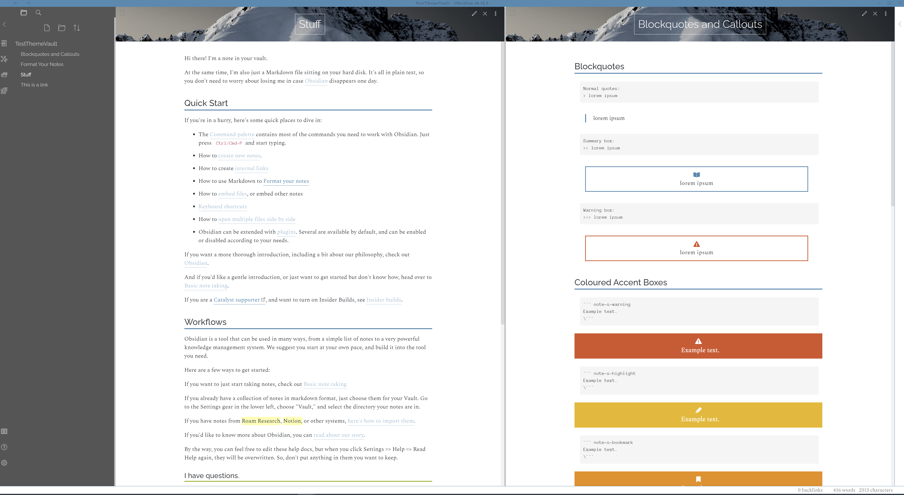

# EbbsianThemeforObsidian
A minimal light theme with rainbow coloured accents.

# Thanks
Many thanks to Deathau for their [Notation Theme](https://github.com/deathau/Notation-for-Obsidian), on which the headers and tables were based.

# To make things work
Download the css file and drop it into your themes folder!

## Fonts
I believe in order for these to work you'll need to download and install the correct fonts locally. 
The primary fonts used are:
- Headers: [Raleway](https://fonts.google.com/specimen/Raleway)
- Body: [Spectral](https://fonts.google.com/specimen/Spectral)

FontAwesome is used for the callout boxes.
[Download here](https://fontawesome.com/how-to-use/on-the-desktop/setup/getting-started) and install the solid bold otf. 

## Settings
This theme is compatible with the Style Settings plugin - there are options to change the header image, accent colour, and header underline colours.


# Screenshots





# Callout Boxes

The theme comes with some built-in callouts in various colours / flavours. 
You'll need FontAwesome installed to make these work!

## Quote Callout Boxes
### Summary
This box is the quickest and easiest to use - simply put your text inside two quotes.
```
>> Lorem ipsum
```


### Warning
Three quotes gives you a red warning box.

```
>>> Lorem ipsum
```


## Solid Colour Boxes
These are generated using code blocks with the header note-s-$.

### Solid Red Warning
A red box with a warning symbol.

```
``` note-s-warning
Example text.
```


### Orange Highlight
Orange box with a highlight symbol.
```
``` note-s-highlight
Example text.
```


### Yellow Bookmark
Yellow box with bookmark symbol.

```
``` note-s-bookmark
Example text.
```


### Green Write
Green box with a quill pen symbol.
```
``` note-s-write
Example text.
```


### Blue Folder
Blue box with a folder symbol.
```
``` note-s-folder
Example text.
```


### Purple Clipboard
Purple box with a clipboard symbol.

```
``` note-s-clip
Example text.
```


## Plain Outlined Boxes
White boxes with coloured outlines and no symbols.
These use code blocks with the syntax note-{colour}.
### Red
```
``` note-red
Example text.
```


### Orange
```
``` note-orange
Example text.
```


### Yellow
```
``` note-yellow
Example text.
```


### Green
```
``` note-green
Example text.
```


### Blue
```
``` note-blue
Example text.
```


### Purple
```
``` note-purple
Example text.
```


### Pink

```
``` note-pink
Example text.
```


